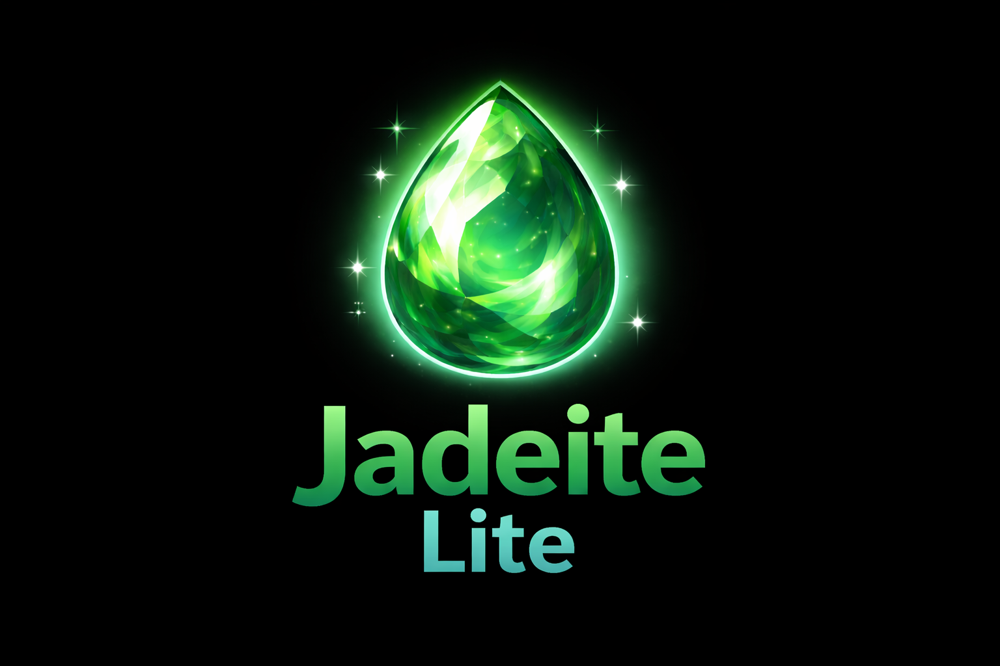

# Jadeite Lite

**Jadeite Lite** is a lightweight starter application built on the **Jadeite 2D Game Engine**, designed specifically for tutorials, experimentation, and rapid feature development.

It provides a clean, stable baseline so you can focus entirely on the topic being taught — without rebuilding windowing, rendering, or tooling boilerplate every time.

---

## Purpose

Jadeite Lite exists to remove friction when learning or demonstrating engine features.

Every tutorial starts from the same known state, making it easy to:
- Follow along with videos
- Reproduce results exactly
- Focus on one concept at a time
- Avoid setup repetition

---

## What This Is

- A reusable **starter application**
- A **known baseline** for tutorials
- A reference setup for engine subsystems
- A clean foundation for experiments and demos

---

## What This Is Not

- Not the full Jadeite engine
- No gameplay systems
- No ECS or scripting by default
- No asset pipelines beyond what is required

Those systems are introduced incrementally per tutorial.

---

## Included Systems

### Core
- SDL2 window and context creation
- Application lifecycle and main loop
- Platform-independent project structure

### Rendering
- OpenGL 4.5 renderer
- Framebuffer abstraction
- Texture system
- 2D camera - Easily chanded to support 3D!
- Resize-safe rendering pipeline

### UI & Tools
- ImGui with full docking support
- Debug and tooling panels

### Utilities
- Structured logging system
- Assertions and error handling
- Minimal configuration support

---

## Typical Workflow

1. Download or clone **Jadeite Starter**
2. Build and run to verify the baseline
3. Follow the tutorial
4. Implement only the feature being covered
5. Archive or discard after completion

Each tutorial starts from a fresh copy of Jadeite Lite.

---

## Use Cases

Jadeite Starter is used as the foundation for tutorials covering topics such as:
- Video playback
- Rendering techniques
- Post-processing
- Tooling and debug UI
- Engine subsystems
- Platform-specific features

---

# Build
----
Requires [CMake 3.26](https://cmake.org/) and [vcpkg](https://github.com/microsoft/vcpkg)
## Get VCPKG:

```ps
git clone https://github.com/microsoft/vcpkg
cd vcpkg
bootstrap-vcpkg.bat -disableMetrics
```

### Make sure the following environment variables are set:
- Windows
```
VCPKG_ROOT=[path_to_vcpkg]
VCPKG_DEFAULT_TRIPLET=x64-windows
```
- Linux
Edit your profile's bashrc file:
```
nano ~/.bashrc
```
Add the following lines at the end:
```
export PATH=<path_to_vcpkg_installation_folder>:$PATH
export VCPKG_ROOT=<path_to_vcpkg_installation_folder>
export VCPKG_DEFAULT_TRIPLET=x64-linux
```
Apply changes:
```
source ~/.bashrc
```

## Install Dependencies
```
vcpkg install fmt glm entt glad soil2 sdl2
```
## Clone the repository 
```
git clone https://github.com/dwjclark11/Scion2D.git
cd Scion2D
cmake -S . -B build
```

---

## License

This project is licensed under the JGS License.
See the `LICENSE` file for details.

## Third-Party Licenses
---
This project makes use of third-party libraries and components that are NOT covered by the Jadeite / JGS License.
Each third-party dependency is licensed under its own respective license terms, which may differ from the license of this project.

*Important Notice*

- The Jadeite Lite source code is licensed under the JGS License.
- Third-party libraries retain their original licenses.
- Users are responsible for reviewing and complying with all applicable third-party license terms.

Please refer to the license files provided by each dependency for full details.
---

## 🙏 Acknowledgments
This project would not be possible without the help of all the contributors, the motivation to keep working forward through the wonderful comments and supporters from my YouTube Channel. 
Also from all the wonderful open source projects that I have been able to use in the creation of this project.

### Open Source Dependencies
Check out these amazing open source projects that we are using in the engine. Make sure to give them all a star! for all of their amazing work.

-   **[EnTT](https://github.com/skypjack/entt)** - Fast and reliable Entity Component System.
-   **[SDL2](https://github.com/libsdl-org/SDL)** -  a cross-platform library that provides an abstraction layer for computer multimedia hardware components.
-   **[SDL_mixer](https://github.com/libsdl-org/SDL_mixer)** - An audio mixer that supports various file formats for Simple Directmedia Layer.
-   **[Dear ImGui](https://github.com/ocornut/imgui)** - Immediate mode GUI for C++.
-   **[ImGuiFileDialog](https://github.com/aiekick/ImGuiFileDialog)** - Full featured file Dialog for Dear ImGui.
-   **[GLM](https://github.com/g-truc/glm)** - Mathematics library for graphics software.
-   **[stb](https://github.com/nothings/stb)** - Single-file public domain libraries.
-   **[SOIL2](https://github.com/SpartanJ/SOIL2)** - SOIL2 is a tiny C library used primarily for uploading textures into OpenGL.
-   **[FMT](https://github.com/fmtlib/fmt)** - A modern formatting library.
-   **[Glad](https://github.com/Dav1dde/glad)** - Multi-Language Vulkan/GL/GLES/EGL/GLX/WGL Loader-Generator based on the official specs.

_Thank you to all the contributors and maintainers of these projects!_ ❤️

